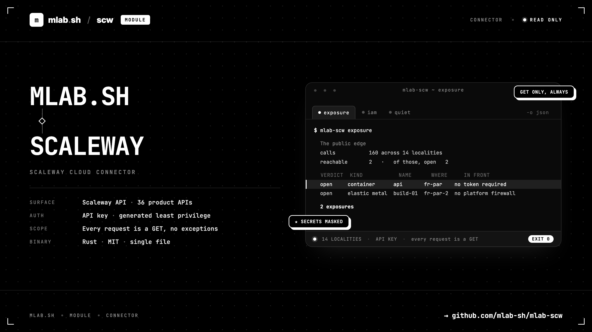

# mlab-scw



**A CLI over the Scaleway API, built as a base for read-only cloud posture
audits.**

It talks to `api.scaleway.com` with a Scaleway API key, and a profile in
`$HOME/.mlab/scw.conf` says which key, which organization and how wide to
sweep.

**Every request it makes is a GET.** There is no flag that sends anything else.

Nothing leaves your machine except the calls to `api.scaleway.com` — with one
exception, opt-in per run: [`advisories --allow-web`](wiki/Advisories.md) asks
vuln.mlab.sh what has been published about the software you run, sending a
product identifier and nothing else. `--explain` prints that payload before it
is sent.

## Install

**Homebrew** (macOS and Linux)

```bash
brew tap mlab-sh/mlab-scw https://github.com/mlab-sh/mlab-scw.git
brew install mlab-scw
```

**Debian, Ubuntu, Fedora and RHEL**: a `.deb` and an `.rpm` per architecture on
the [releases page](https://github.com/mlab-sh/mlab-scw/releases), alongside
prebuilt tarballs for macOS and Linux on x86_64 and arm64. Every release carries
a `SHA256SUMS` file covering all of its assets.

**From source**, with a recent Rust toolchain:

```bash
git clone https://github.com/mlab-sh/mlab-scw.git
cd mlab-scw && cargo build --release
```

See [Install](wiki/Install.md) for the details, and
[Releasing](wiki/Releasing.md) for how these packages are built.

## First run

Create an API key in the console (**IAM → API keys**), give it an application
of its own, and attach only the read-only permission sets the catalogue asks
for:

```bash
mlab-scw catalog --permissions
```

Then:

```bash
mlab-scw login --name prod
mlab-scw ping
mlab-scw whoami
```

`login` prompts for the secret key without echoing it, shape-checks both halves
of the pair before spending a request, verifies them against the API, discovers
the organization, and writes the config file with mode 0600 in a 0700
directory.

Scaleway has no "who am I" endpoint: `/account/v3/projects` requires an
`organization_id`, and an API key does not carry one. `login` resolves it the
long way — key, then the application or user bearing it — and asks for it only
if the key cannot read IAM. See
[Configuration](wiki/Configuration.md#finding-the-organization).

## Commands

| Command | What it does |
| --- | --- |
| [`catalog`](wiki/Catalog.md) | What can be audited, why, and with which permission sets. Reads nothing; start here. |
| [`login`](wiki/Login.md) | Create or update a profile, prove the credentials work, save them. |
| [`ping`](wiki/Ping.md) | Probe the API and report which permission sets actually answered. |
| [`whoami`](wiki/Whoami.md) | What this key is, and every policy, permission set and scope behind it. |
| [`iam`](wiki/Iam.md) | Who can do what, and 26 graded checks on it. The first real audit. |
| [`exposure`](wiki/Exposure.md) | What answers from the internet, what narrows it, and 30 checks on the gap. |
| [`quiet`](wiki/Quiet.md) | The products nobody looks at: plaintext credentials, dangling names, forgotten data. |
| [`advisories`](wiki/Advisories.md) | What the account runs, against what has been published about it. |

113 of the catalogue's 229 checks are derived today. Every report names what it
did not look at; [Roadmap](wiki/Roadmap.md) names what is not built yet.
| [`project`](wiki/Project.md) | The projects the key can see — the boundary of every other answer. |
| [`api`](wiki/Api.md) | Raw GET against any path, for everything not wrapped yet. |
| [`profile`](wiki/Profile.md) | List, show, select and delete saved profiles. |
| [`config`](wiki/Config.md) | Where the config file is, and what is in it. |
| [`completions`](wiki/Completions.md) | A shell completion script for bash, zsh, fish, elvish or PowerShell. |

Every command renders to the terminal by default and to raw JSON with `-o json`.
Progress goes to stderr, results to stdout, so a pipeline stays parsable while a
spinner is running. See [Output](wiki/Output.md).

### The catalogue

`catalog` is the spine of the tool: 36 product APIs, the resources worth
reading in each, and the findings each response supports.

```bash
mlab-scw catalog                       # the whole audit surface, as a table
mlab-scw catalog k8s                   # one product, in prose
mlab-scw catalog --checks              # every check, worst first
mlab-scw catalog --checks --severity critical
mlab-scw catalog --permissions         # the least-privilege policy to attach
mlab-scw catalog -o json               # the same, for a pipeline
```

Because it is data rather than code, the policy the tool needs is *generated*
from what it intends to read rather than guessed at.

## Scope

Scaleway splits its APIs three ways, and an audit that forgets this reports a
clean account:

- **global** — one endpoint (IAM, Account, Domains, Billing, Edge Services);
- **regional** — `fr-par`, `nl-ams`, `pl-waw`, `it-mil`;
- **zonal** — nine Availability Zones plus `it-mil-1`.

By default every sweep covers all of them. `--region` narrows both regional and
zonal products; `--zone` narrows a zonal sweep to that zone and a regional one
to its parent region, so one flag means one place.

## Configuration

Flags override environment variables, which override the profile. Both
`MLAB_SCW_*` and plain `SCW_*` are read, the second spelling on purpose: a
shell already set up for Scaleway's own CLI or the Terraform provider needs no
second set of variables.

| Variable | Meaning |
| --- | --- |
| `SCW_ACCESS_KEY` | Access key (`SCW…`) |
| `SCW_SECRET_KEY` | Secret key (a UUID) |
| `SCW_DEFAULT_ORGANIZATION_ID` | Organization to query |
| `SCW_DEFAULT_PROJECT_ID` | Narrow every listing to one project |
| `SCW_DEFAULT_REGION` / `SCW_DEFAULT_ZONE` | Narrow the sweep |
| `MLAB_SCW_CONFIG` | Path of the config file |

## Read-only is not read-only

A key holding nothing but `…ReadOnly` permission sets still receives live
credentials from several products: an Apple silicon `sudo_password`, an Elastic
Metal BMC login, a Domains managed-certificate `private_key`, an EPP transfer
`auth_code`. The `api` command replaces those with their length unless
`--unsafe-values` is passed. See [Secrets](wiki/Secrets.md).

## Documentation

Everything lives in the **[wiki](https://github.com/mlab-sh/mlab-scw/wiki)**,
one page per command plus the concepts they rest on:

- [Install](wiki/Install.md) — building it, and creating the API key it should use.
- [Configuration](wiki/Configuration.md) — profiles, and the precedence between
  flags, environment and file.
- [Surfaces](wiki/Surfaces.md) — how the API is shaped, and the four ways that
  shape produces a wrong answer.
- [Output](wiki/Output.md) — the human render, `-o json`, and which stream gets what.
- [Secrets](wiki/Secrets.md) — why a read-only API key is not read-only in the
  way you would hope.
- [Roadmap](wiki/Roadmap.md) — what is built and what is next.
- [Releasing](wiki/Releasing.md) — how a version becomes a tarball, a package
  and a formula.

The pages are written in [`wiki/`](wiki/Home.md) in this repository and mirrored
to the GitHub wiki by
[`.github/workflows/wiki-sync.yml`](.github/workflows/wiki-sync.yml) on every
push to `main` that touches them. The repository is the source of truth, so edit
the files here rather than the pages in the wiki UI, which are overwritten on the
next sync.

Every identifier in the documentation is invented — see the table in
[Home](wiki/Home.md#a-note-on-the-examples). Nothing there belongs to a real
account.

## Layout

```
src/
  main.rs          entry point
  cli/             the clap surface, and the context a command runs in
  commands/        one file per command
  scw/             the HTTP client, profiles, localities, identity, the catalogue
  audit/           the graded checks, as pure functions over fetched data
  enrich/          the advisory corpus, and the CPE table it is asked with
  ui/              the terminal render and the progress rules
wiki/              the documentation, mirrored to the GitHub wiki
.github/workflows/ CI, the release pipeline, and the wiki sync
Formula/           the Homebrew formula, regenerated at every release
```

Built to the same shape as [mlab-unifi](https://github.com/mlab-sh/mlab-unifi).
